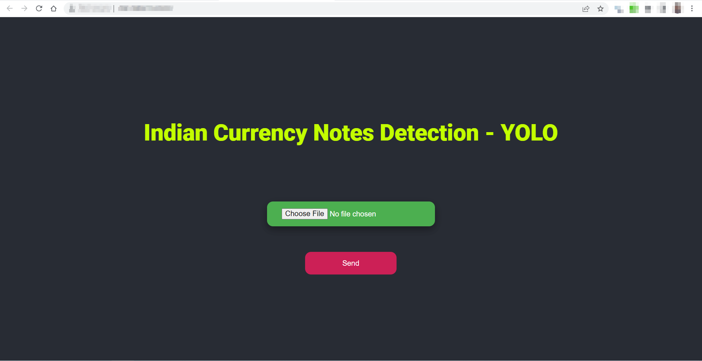

# 🇮🇳 Indian Currency Note Detection YOLO ✨💰

## Unleashing AI: Real-time Indian Banknote Recognition with YOLOv5 & Flask

---

<p align="center">
  
  <br>
  <em><span style="color: #FFD700; font-weight: bold;">Precision in Action:</span> Witnessing a 500 Rupee note accurately identified with bounding box and high confidence.</em>
</p>


## 🌟 Table of Contents

* [✨ Project Overview](#-project-overview)
* [🚀 Key Features](#-key-features)
* [🛠️ Technologies & Libraries](#%EF%B8%8F-technologies--libraries)
* [📦 Installation Guide](#-installation-guide)
    * [1. Clone the Repository](#1-%EF%B8%8F-clone-the-repository)
    * [2. Create and Activate Virtual Environment](#2-%EF%B8%8F-create-and-activate-virtual-environment)
    * [3. Install Dependencies](#3-%EF%B8%8F-install-dependencies)
    * [4. Set up YOLOv5 Model Weights (`best.pt`)](#4-%EF%B8%8F-set-up-yolov5-model-weights-bestpt)
* [▶️ How to Use](#%EF%B8%8F-how-to-use)
    * [1. Start the Backend Server](#1-%EF%B8%8F-start-the-backend-server)
    * [2. Access the Web Interface](#2-%EF%B8%8F-access-the-web-interface)
    * [3. Upload Image & Detect](#3-%EF%B8%8F-upload-image--detect)
* [📁 Project Structure](#-project-structure)
* [🔗 API Endpoints](#-api-endpoints)
* [🤝 Contributing](#-contributing)
* [📄 License](#-license)
* [🙏 Acknowledgements](#-acknowledgements)

---

## ✨ Project Overview

<p style="font-size: 1.1em; line-height: 1.6; color: #E0E0E0;">
  Welcome to <strong>Indian Currency Note Detection YOLO</strong> – an innovative web application poised to revolutionize how we identify Indian Rupee banknotes. Leveraging the cutting-edge capabilities of <span style="color: #4CAF50; font-weight: bold;">YOLOv5 for object detection</span>, this project provides a seamless, real-time solution for currency recognition.
</p>
<p style="font-size: 1.1em; line-height: 1.6; color: #E0E0E0;">
  The application is meticulously engineered with a robust <span style="color: #F0A000; font-weight: bold;">Flask backend</span>, orchestrating efficient image processing and deep learning inference. Complementing this is an intuitive frontend crafted with <span style="color: #64B5F6; font-weight: bold;">HTML, CSS, and JavaScript</span>, ensuring a smooth and engaging user experience. Beyond simple detection, RupeeSense delivers rich contextual information:
</p>
<ul>
  <li>🔢 Total monetary value calculation.</li>
  <li>💯 Confidence scores for each identified note.</li>
  <li>🗣️ Bilingual descriptions in <span style="color: #FFCC00; font-weight: bold;">English</span> and <span style="color: #66CCFF; font-weight: bold;">Hindi</span>.</li>
</ul>
<p style="font-size: 1.1em; line-height: 1.6; color: #E0E0E0;">
  Whether you're a developer eager to integrate AI into real-world scenarios, a student exploring computer vision, or simply seeking a reliable tool for Indian currency identification, this project offers a compelling and functional demonstration of AI in action.
</p>

---

## 🚀 Key Features

A glimpse into what **Indian Currency Note Detection YOLO** offers:

* **🎯 High-Accuracy Detection:** Powered by a <span style="color: #4CAF50; font-weight: bold;">custom-trained YOLOv5 model</span>, ensuring unparalleled precision in identifying various Indian Rupee denominations.
* **🌐 Intuitive Web Interface:** A <span style="color: #64B5F6; font-weight: bold;">clean, responsive, and user-friendly</span> web application for effortless image uploads and interactive results.
* **⚡ Blazing-Fast Inference:** Optimized for <span style="color: #FF5722; font-weight: bold;">rapid processing</span>, delivering near real-time detection results on uploaded currency images.
* **🗣️ Bilingual Accessibility:** Presents detected currency information and descriptions in both <span style="color: #FFCC00; font-weight: bold;">English</span> and <span style="color: #66CCFF; font-weight: bold;">Hindi</span>, catering to a wider audience.
* **➕ Intelligent Summation:** Automatically calculates and displays the <span style="color: #FFD700; font-weight: bold;">total monetary value</span> of all identified banknotes within an image.
* **📊 Confidence Metrics:** Each successful detection is accompanied by a <span style="color: #9C27B0; font-weight: bold;">confidence score</span>, reflecting the model's certainty in its prediction.
* **🖼️ Visual Feedback:** Displays the uploaded image with <span style="color: #2196F3; font-weight: bold;">clear bounding boxes and labels</span> overlaid, offering immediate visual confirmation of detected notes.

---

## 🛠️ Technologies & Libraries

This project is meticulously built using a powerful and modern stack to deliver its advanced capabilities:

* **Backend (Python 3.10+):**
    * **[Flask](https://flask.palletsprojects.com/)**: The lightweight and flexible web framework that serves as the API backbone.
    * **[PyTorch](https://pytorch.org/)**: The cornerstone deep learning framework for building and running the YOLOv5 model.
    * **[OpenCV (cv2)](https://opencv.org/)**: Indispensable for image manipulation, preprocessing, and drawing visual detections.
    * **[NumPy](https://numpy.org/)**: The foundational package for high-performance numerical computing in Python.
    * **[Pandas](https://pandas.pydata.org/)**: Utilized for efficient data handling within the YOLOv5 framework's utilities.
    * **[Ultralytics YOLOv5](https://github.com/ultralytics/yolov5)**: The state-of-the-art object detection model at the heart of the recognition system.
* **Frontend:**
    * **HTML5**: Provides the semantic structure for a robust web application.
    * **CSS3**: Styles the application for a modern, responsive, and visually appealing user experience.
    * **JavaScript (jQuery)**: Handles dynamic interactions, AJAX communication with the Flask backend, and enhances user experience.

---

## 📦 Installation Guide

Ready to get **Indian Currency Note Detection YOLO** up and running on your local machine? Follow these precise steps:

### 1. ⬇️ Clone the Repository

Begin your journey by cloning the project's GitHub repository:

```bash
git clone [https://github.com/](https://github.com/)[YOUR_USERNAME]/Indian-Currency-YOLO.git
cd Indian-Currency-YOLO
2. 🐍 Create and Activate Virtual Environment
It's paramount to use a Python virtual environment to isolate project dependencies and avoid conflicts with other Python installations.

Bash

python -m venv venv
.\venv\Scripts\activate # For Windows users
# source venv/bin/activate # For macOS/Linux users
3. ⚙️ Install Dependencies
With your virtual environment activated, install all necessary Python packages specified in requirements.txt:

Bash

pip install -r requirements.txt
&lt;p style="color: #FF5722; font-weight: bold;">
⚠️ Dependency Compatibility Note:
&lt;/p>
&lt;p style="font-size: 0.95em; color: #FFEBEE;">
This project relies on specific versions of core libraries (e.g., &lt;span style="color: #FFD700;">&lt;code>numpy&lt;/code>&lt;/span>, &lt;span style="color: #FFD700;">&lt;code>torch&lt;/code>&lt;/span>, &lt;span style="color: #FFD700;">&lt;code>opencv-python&lt;/code>&lt;/span>, &lt;span style="color: #FFD700;">&lt;code>pandas&lt;/code>&lt;/span>) for optimal compatibility with YOLOv5. The &lt;span style="color: #FFD700;">&lt;code>requirements.txt&lt;/code>&lt;/span> file is meticulously generated to reflect these exact versions. If you encounter any &lt;span style="color: #FF5722; font-weight: bold;">&lt;code>RuntimeError&lt;/code>&lt;/span> (e.g., "module compiled against ABI version...") or &lt;span style="color: #FF5722; font-weight: bold;">&lt;code>ValueError&lt;/code>&lt;/span> (e.g., "numpy.dtype size changed..."), it typically indicates a version mismatch. Re-running &lt;span style="color: #FFD700;">&lt;code>pip install -r requirements.txt&lt;/code>&lt;/span> within a freshly created virtual environment should resolve most such issues.
&lt;/p>

4. 🧠 Set up YOLOv5 Model Weights (best.pt)
The heart of the detection system is a custom-trained YOLOv5 model. You must place your best.pt model weights file in the designated location within the project structure.

Obtain your best.pt file: This crucial file is the output of your YOLOv5 training process. Locate it from your YOLOv5 training runs directory (e.g., yolov5/runs/train/exp/weights/best.pt). If you're using a pre-trained model for Indian Currency, ensure you download the correct .pt file from its source (e.g., Hugging Face, Kaggle).

Place the model file: Create the necessary nested directory structure inside your Indian-Currency-YOLO/yolov5 folder (if it doesn't already exist) and then copy your best.pt file into the weights directory:

Indian-Currency-YOLO/
├── yolov5/
│   └── runs/
│       └── train/
│           └── exp/          # 👈 This 'exp' folder might be 'exp1', 'exp2', etc., based on your training runs. Adjust if necessary.
│               └── weights/    #
│                   └── best.pt # <--- Place your trained model file HERE!
└── ...
Critical: Ensure that the model_name path specified in your yolo_detection.py file (e.g., ./yolov5/runs/train/exp/weights/best.pt) precisely matches the actual location where you have placed your best.pt file.

▶️ How to Use
Once all dependencies are meticulously installed and your model weights are in place, running the application is straightforward and intuitive:

1. ▶️ Start the Backend Server
From the root of your project directory (Indian-Currency-YOLO), with your virtual environment activated, execute the Flask application:

Bash

python app.py
The Flask development server will spring to life, typically accessible at http://127.0.0.1:8080/. Keep this terminal window open and running – it's the engine of your application.

2. 🌐 Access the Web Interface
Open your preferred web browser (e.g., Google Chrome, Mozilla Firefox, Microsoft Edge) and navigate to the application's URL:

[http://127.0.0.1:8080/](http://127.0.0.1:8080/)
3. 📸 Upload Image & Detect
On the elegant web page, click the "Choose File" button to effortlessly select an image file containing Indian currency notes from your local machine.
Once your file is selected, click the vibrant "Send" button to initiate the sophisticated currency detection process.
Observe as the application dynamically displays the uploaded image with &lt;span style="color: #2196F3; font-weight: bold;">clear bounding boxes and labels&lt;/span> indicating the detected notes. Alongside this visual feedback, you'll find the calculated total amount, individual confidence scores, and detailed descriptions in both English and Hindi.
📁 Project Structure
A meticulously organized hierarchy of the project's directory and file structure, guiding you through its components:

Indian-Currency-YOLO/
├── app.py                  # 🌐 Flask Backend: Main application entry point, handles web routes and API calls.
├── yolo_detection.py       # 🧠 YOLOv5 Core: Encapsulates model loading, inference logic, and result parsing.
├── requirements.txt        # 📋 Python Dependencies: Exhaustive list of all required packages and their exact versions.
├── README.md               # 📄 Project Documentation: This comprehensive guide!
├── static/                 # 🎨 Frontend Assets: Contains static files for the web interface.
│   ├── index.css           #   - Styling rules for the application's visual appeal.
│   └── index.js            #   - Client-side JavaScript for dynamic interactions and AJAX.
├── templates/              # 🖥️ HTML Templates: Web page structures.
│   └── index.html          #   - The primary user interface served by Flask.
└── venv/                   # 🐍 Python Virtual Environment (automatically excluded by Git).
└── yolov5/                 # 🚀 YOLOv5 Repository Clone: The core YOLOv5 source code.
    └── runs/               #   - Training/Detection Outputs (partially tracked by Git).
        └── train/          #     - Specific training run logs and artifacts.
            └── exp/        #       - A particular experiment folder (e.g., 'exp1', 'exp2').
                └── weights/    #         - Contains the trained model weights.
                    └── best.pt # <--- Your custom-trained YOLOv5 model weights reside here.
    └── ... (other essential YOLOv5 source files, e.g., models/, utils/, data/)
🔗 API Endpoints
The Flask backend meticulously exposes the following endpoints, enabling seamless interaction with the detection capabilities:

GET /:
Description: Serves the main web application interface (index.html).
Method: GET
POST /detectObject:
Description: Receives an image file, performs highly accurate Indian currency detection using the YOLOv5 model, and returns a comprehensive JSON response.
Method: POST
Request Body: Expects multipart/form-data with a file field named image containing the uploaded image.
Response (JSON Object):
status: A base64 encoded string representing the processed image (with bounding boxes and labels drawn on it).
englishmessage: A string providing the English description of the detected notes (e.g., "Image contains one 100Rupees Note and two 50Rupees Notes.").
hindimessage: A string offering the Hindi description of the detected notes.
raw_labels: A dictionary mapping detected note types to their respective counts (e.g., {'100Rupees': 1, '500Rupees': 2}).
confidence_scores: A dictionary mapping detected note types to their confidence percentages (e.g., {'100Rupees': 98.50, '500Rupees': 95.23}).
